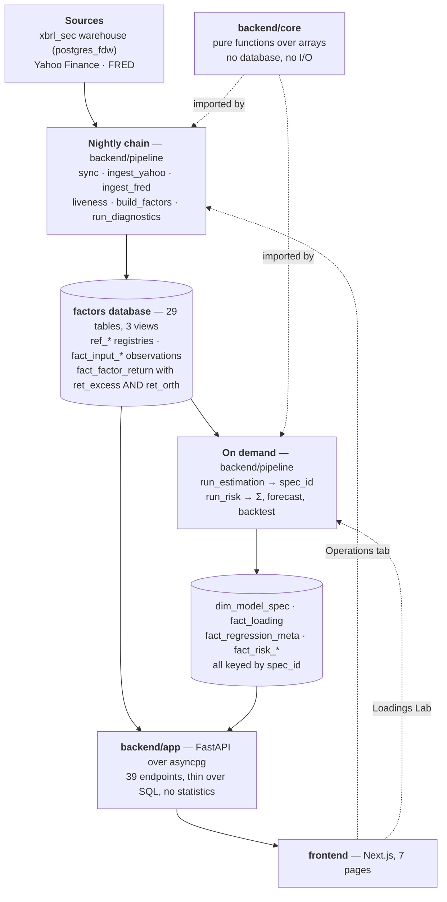

# Database and backend architecture

What the setup scripts in this folder actually create, and how the backend uses
it. [README.md](README.md) is the install manual; this is the reference behind
it.

> **[architecture.pdf](architecture.pdf)** is this document typeset, with both
> workflow diagrams drawn in TikZ and the schema inventory dumped from the running
> database at build time. Rebuild it with `python -m scripts.build_architecture`.

For the statistics rather than the plumbing, see
[the paper](../Documentation/factor-model-paper.pdf) — §7 is the operating
workflow with a flowchart, §8 the architecture at a higher level, and Appendix A
every statistical procedure.

---

## 1. The shape of the system



Two rules hold the design together.

**`backend/core` touches nothing.** Every statistical routine is a pure function
over NumPy arrays: no database handle, no configuration lookup, no logging side
effect. That is what makes the accuracy claims testable — a test feeds each
routine a process whose answer is known analytically and asserts it gets there,
with no fixture and no database. The alternative, statistics computed inside the
query that fetches the data, would make every claim checkable only by reading it.

**The database is the only shared state.** `backend/pipeline` writes it,
`backend/app` reads it, and neither calls the other. A failed refresh leaves
yesterday's panel intact and every cached specification still readable.

---

## 2. Naming convention

The prefix says what a table is for, and therefore who is allowed to write it.

| Prefix | Meaning | Written by | Example |
|---|---|---|---|
| `ref_` | Reference data: what exists and how to treat it | `sync`, `seed` | `ref_factor`, `ref_instrument` |
| `fact_` | Observations and results, keyed by a natural key | pipeline jobs | `fact_factor_return` |
| `dim_` | A dimension other tables key into | `run_estimation` | `dim_model_spec` |
| `stage_` | Scratch space inside one job's transaction | ingest jobs | `stage_return` |
| `etl_` | Operational state: what ran, when, how it went | every job | `etl_run` |
| `v_` | Views — no storage, read by the API | — | `v_data_health` |
| `warehouse_sec.` | Foreign tables. **Read-only, never written** | — | `warehouse_sec.fact_cross_asset` |

---

## 3. Migrations

Fifteen files in [`sql/`](../sql), applied in order by a runner that fails fast:
a migration error aborts with a non-zero exit code rather than logging and
continuing, so a partially applied schema can never be mistaken for a good one.
Every file is idempotent — `CREATE TABLE IF NOT EXISTS`, `CREATE OR REPLACE
VIEW` — so re-running is safe.

| Migration | Creates |
|---|---|
| `001_reference.sql` | `ref_factor_block`, `ref_instrument`, `ref_factor`, `ref_calendar` |
| `002_inputs.sql` | `fact_input_return`, `fact_input_level`, `ref_level_series`, `fact_input_fx`, `fact_reference_factor` |
| `003_factors.sql` | `fact_factor_return`, `fact_factor_build` |
| `004_diagnostics.sql` | `fact_series_diagnostics`, view `v_series_diagnostics_latest` |
| `005_estimation.sql` | `dim_model_spec`, `fact_loading`, `fact_regression_meta`, view `v_regression_quality` |
| `006_covariance.sql` | `fact_factor_cov`, `fact_factor_cov_meta`, `fact_specific_risk`, `fact_residual_pca` |
| `007_risk.sql` | `fact_risk_forecast`, `fact_risk_contribution`, `fact_risk_backtest` |
| `008_ops.sql` | `etl_run`, `etl_item_state`, `stage_return`, `stage_level`, view `v_data_health` |
| `009_fdw.sql` | extension `postgres_fdw`, server `warehouse` |
| `010_fdw_import.sql` | schema `warehouse_sec` with 11 foreign tables |
| `011_risk_reliability.sql` | partial index on reliable forecasts |
| `012_chat.sql` | `chat_thread`, `chat_message` |
| `013_beta_overlap.sql` | `fact_regression_meta.beta_overlap` column |
| `014_block_names_en.sql` | block name corrections |
| `015_security_catalogue.sql` | `ref_security` |

009 and 010 are split because `IMPORT FOREIGN SCHEMA` is not idempotent —
dropping and re-importing is how a warehouse schema change gets picked up — and
because the user mapping between them carries a password and cannot live in a
committed file.

---

## 4. The tables

Sizes are from a fully loaded install: 687 MB in total.

### Reference — what exists

| Table | Primary key | Rows | Purpose |
|---|---|---|---|
| `ref_factor_block` | `block_id` | 9 | The nine blocks, with sort order and display name |
| `ref_factor` | `factor_id` | 40 | Construction method, inputs, hierarchy level, `orthogonalize_against` |
| `ref_instrument` | `instrument_id` | 204 | Every priced series: source table, currency, `is_total_return`, role, liveness |
| `ref_level_series` | `series_id` | 53 | Yields, spreads and indices, with the transform each needs |
| `ref_calendar` | `date` | 8,198 | The trading calendar. **Crypto is excluded** — it prices seven days a week, and including it made 252-row windows span fewer than 252 trading days |
| `ref_security` | `instrument_id` | 9,434 | Everything the warehouse can price, for the Loadings Lab search box |

`ref_factor.orthogonalize_against` is a `text[]` of factor ids. It encodes the
block hierarchy, and because every target is at a lower level the graph is
acyclic by construction and the panel builds in one pass.

`ref_security` is materialised nightly rather than derived on read: computing it
means aggregating two price tables of fifteen million rows apiece, about eight
seconds per keystroke in a search box.

### Inputs — raw observations

| Table | Primary key | Rows | Size |
|---|---|---|---|
| `fact_input_return` | `instrument_id, date` | 1,016,170 | 241 MB |
| `fact_input_level` | `series_id, date` | 253,513 | 53 MB |
| `fact_input_fx` | `ccy, date` | 274,485 | 39 MB |
| `fact_reference_factor` | `dataset, factor, date` | 452,553 | 129 MB |

`fact_input_return` carries `source` (`warehouse` or `yahoo`) and `currency`, so
a row's provenance is a column rather than an inference. Securities pulled on
demand are converted to the base currency at ingestion —
`r_usd = r_local + r_fx` in logs — because storing a local-currency return and
regressing it on dollar factors makes the currency appear as a spurious exposure.

`fact_reference_factor` holds Fama-French and AQR series. They lag by one to two
months and can never drive a daily model; they exist to confirm that a
construction measures what its name claims.

### Factors

| Table | Primary key | Rows | Size |
|---|---|---|---|
| `fact_factor_return` | `factor_id, date` | 200,147 | 48 MB |
| `fact_factor_build` | `factor_id, built_at` | small | build provenance per factor |
| `fact_series_diagnostics` | `series_key, series_type, as_of_date, window_days` | 893 | 552 kB |

**One table, two panels.** `fact_factor_return` has both bases side by side:

```sql
fact_factor_return(factor_id, date, ret_excess, ret_orth, ...)
```

`ret_excess` is the raw excess return; `ret_orth` is the block-hierarchy residual,
fitted causally on a trailing 504-day window refitted every 21 days. Storing both
rather than deriving one on read is what lets a specification declare which panel
it was estimated on and be scored against the matching covariance. Portfolio risk
is β′Σβ, so Σ must be the covariance of the same series the βs refer to; pairing
one panel's betas with the other's covariance produces a wrong number with no
error and nothing implausible to give it away.

`fact_series_diagnostics` has 42 columns — every statistic the stationarity
battery produces, mapping one-to-one onto the `Diagnostics` dataclass in
`backend/core/stationarity.py`. `v_series_diagnostics_latest` picks the newest
row per series and window.

### Estimation — keyed by `spec_id`

| Table | Primary key | Rows | Size |
|---|---|---|---|
| `dim_model_spec` | `spec_id` | 13 | The parameters, and the `orthogonalized` flag |
| `fact_loading` | `spec_id, instrument_id, window_end, factor_id` | 390,184 | 150 MB |
| `fact_regression_meta` | `spec_id, instrument_id, window_end` | 11,599 | 6 MB |

`spec_id` is the first 32 hex characters of a SHA-256 over the canonical JSON of
every parameter that changes the answer: window, step, estimator, weighting,
half-life, ridge λ, Dimson lags, winsorisation, HAC lags, minimum observations,
the sorted factor set, and the factor panel.

Two things follow. Re-requesting a view an analyst has already seen is a table
read rather than several hundred regressions. And any stored number is
reproducible: the specification behind it can be recovered from its identifier
and re-run. The Loadings Lab's run inspector does exactly that, unpacking a
`spec_id` back into the parameters that produced it.

`fact_regression_meta` carries 23 columns of per-window diagnostics — R², adjusted
R², F and its p-value, RMSE, residual volatility, Durbin-Watson, condition number,
max VIF, Ljung-Box and ARCH-LM on the residuals, the L1 beta shift, the
correlation with the previous window, and the size of the overlapping factor set.
Those last three are the drift alert; the condition number and max VIF are what
the reliability gate reads.

### Covariance and risk

| Table | Primary key | Purpose |
|---|---|---|
| `fact_factor_cov` | `spec_id, as_of_date, method, factor_i, factor_j` | Σ in long form, one row per pair |
| `fact_factor_cov_meta` | `spec_id, as_of_date, method` | Condition number, smallest eigenvalue, shrinkage intensity, whether PSD repair fired |
| `fact_specific_risk` | `spec_id, instrument_id, as_of_date` | σ_ε, raw and floored, with the shrinkage weight |
| `fact_residual_pca` | `spec_id, as_of_date, component` | PCA on the regression residuals — a control on whether a factor is missing |
| `fact_risk_forecast` | `spec_id, instrument_id, as_of_date, horizon_days, cov_method` | Every forecast, with `is_reliable` and `unreliable_reason` |
| `fact_risk_contribution` | `spec_id, instrument_id, as_of_date, block_id` | Euler contributions by block |
| `fact_risk_backtest` | `spec_id, instrument_id, sample_start, sample_end, horizon_days, cov_method` | 31 columns: bias, Mincer-Zarnowitz, Kupiec, Christoffersen at both levels |

Forecasts built on ill-conditioned windows are **stored, flagged and excluded
from scoring** — not silently dropped and not silently used. `is_reliable` and
`unreliable_reason` are columns for that reason, and `011_risk_reliability.sql`
adds a partial index so the scored subset is cheap to select.

### Operations

| Table | Primary key | Purpose |
|---|---|---|
| `etl_run` | `run_id` | One row per job invocation: mode, scope, status, rows in/out, failure count, error |
| `etl_item_state` | `job, item_key` | Per-item state, so a partial failure is resumable rather than a restart |
| `stage_return`, `stage_level` | `run_id, ...` | Scratch inside one transaction |

`v_data_health` joins these into what the Data Health page and the Operations tab
read.

### Assistant

`chat_thread` and `chat_message` store every exchange **together with the page
snapshot the answer was grounded in**, which is what lets a statement be checked
later against the numbers that were on screen when it was made.

---

## 5. Indexes

55 indexes. Beyond the primary keys, three patterns:

**Date lookups.** Every `fact_*` time series has an index on `date` alone, for
"everything as of this day" queries — the covariance matrix and the data-health
banner both need them.

**Composite lookup keys.** `idx_loading_lookup` and `idx_reg_meta_lookup` cover
`(spec_id, instrument_id, window_end)`, which is the access path for every
Loadings Lab request. `idx_loading_factor` covers the transpose — one factor
across every window — for the beta-path charts.

**Partial indexes.** `idx_risk_forecast_reliable` covers only the rows where
`is_reliable`, because scoring reads exactly that subset and it is the majority
of risk queries.

`ref_security` carries four, including `lower(name) text_pattern_ops` for the
search box — `text_pattern_ops` so a prefix `LIKE` can use the index under any
collation. Scanning 9,434 rows per keystroke would be visible latency.

---

## 6. The warehouse contract

Eleven foreign tables are imported into `warehouse_sec`. If you are pointing the
model at your own database, this is what it must provide in a schema called
`sec`.

| Foreign table | Columns read | Used for |
|---|---|---|
| `dim_cross_asset` | `ticker, name, asset_class` | Seeds `ref_instrument` |
| `fact_cross_asset` | `ticker, date, close, adj_close, return, log_return, volume, currency` | Fund, index, futures, FX and crypto prices |
| `ref_macro_series` | `series_id, name` | Names for `ref_level_series` |
| `fact_macro` | `series_id, date, value` | Yields, spreads, policy rates, indices |
| `fact_fx` | `ccy, fx_date, usd_per_unit` | Base-currency conversion |
| `fact_fama_french` | `dataset, factor, date, return_pct, value, return_log` | Reference factors for validation |
| `dim_ff_dataset` | — | Dataset registry |
| `fact_prices_us` | `ticker, date, close, adj_close, return, log_return, volume` | US equity prices, on demand |
| `fact_prices_jp` | same | Japanese equity prices, on demand |
| `dim_company_us` | `primary_ticker, name, exchange, gics_sector_name` | Names for the catalogue |
| `dim_company_jp` | `primary_ticker, name, gics_sector_name` | Names for the catalogue |

Two quirks the sync code handles, worth knowing if you are building a substitute:

- **`fact_fama_french` carries two conventions in one table.** The Ken French
  loader fills `return_pct` in percent (0.5 = +0.5%); the AQR loader fills only
  `value`, as a decimal (0.005 = +0.5%). Both are normalised to percent on the
  way in. Reading only `return_pct` makes every AQR series arrive NULL and drop
  silently out of the validation.
- **`dim_company_jp.primary_ticker` carries the Tokyo suffix** (`7203.T`) while
  `fact_prices_jp.ticker` does not (`7203`). Joining them directly matched 17
  names out of 3,878; the catalogue query joins on
  `d.primary_ticker IN (c.ticker, c.ticker || '.T')`.

The wrapper is configured with `fetch_size '50000'` and
`use_remote_estimate 'true'`: large batches because the transfers are bulk, and
remote estimates because without them the planner assumes default selectivity for
foreign tables and chooses a nested loop over a million rows.

---

## 7. The backend

```
backend/
  core/         2,309 lines. Pure functions over arrays. No I/O.
                stationarity · transforms · orthogonalize · regression
                covariance · risk · distribution · summary
  pipeline/     4,498 lines. Jobs. May touch the database (psycopg2).
                sync · ingest_yahoo · ingest_fred · build_factors
                run_diagnostics · run_estimation · run_risk · scheduler
                formula · factor_defs · seed · dbsync · apply_schema
  app/          3,726 lines. FastAPI over asyncpg. No statistics.
                main · db · settings · runs · provenance
                routers/{meta,factors,raw,matrix,loadings,risk,ops,chat}
                ai/{providers,corpus,context,prompts}
  tests/        4,252 lines, 352 tests
```

### Two drivers, deliberately

**asyncpg** in the API. Connection pool (`POOL_MIN`/`POOL_MAX`), a
`statement_timeout` applied per session, and async all the way down so one slow
query does not block the event loop.

**psycopg2** in the pipeline. The jobs are synchronous, long-running and
transactional, and `execute_values` for bulk insert is what makes a million-row
sync finish in seconds. Async would buy nothing in a batch job and would
complicate the transaction boundaries that make a partial failure resumable.

One caveat that cost a debugging session: **asyncpg renders PostgreSQL `numeric`
as a JSON string**, so an endpoint returning `EXTRACT(EPOCH ...)` handed the
browser `"12.4"` where it expected a number, and `.toFixed()` threw inside
render and blanked the page. Cast to `::double precision` in the query.

### Request lifecycle

**A read** — say the Factor Explorer asking for a series:

```
GET /api/factors/eq_global/series?basis=orth
  → routers/factors.py builds one SQL statement
  → asyncpg pool executes it
  → rows serialised straight to JSON
```

The router does no arithmetic. Anything statistical it needs comes from
`backend/core`, called on the arrays the query returned.

**An estimate** — the one long-running path:

```
POST /api/loadings/estimate
  → hash the parameters to a spec_id
  → if fact_loading already has rows for it, return them (a table read)
  → otherwise: pull the security if it has never been priced here
             → core.regression.fit once per roll-forward step
             → write fact_loading + fact_regression_meta
             → return
```

A wide window rolled weekly is upward of a thousand regressions and the request
does not return until every one is written, which is why the interface counts
elapsed seconds rather than showing a static spinner — a motionless
"Estimating…" for half a minute is indistinguishable from a hung page.

### Writes from the API

Only two endpoints write, and both are deliberate:

- `POST /api/loadings/estimate` — writes loadings and diagnostics under a
  `spec_id`.
- `POST /api/ops/refresh` — starts the nightly chain **as a subprocess**, not in
  the event loop. It is synchronous and minutes long, so running it in-process
  would freeze every other request; and running the same command a person would
  type means a refresh from the browser and one from a shell are the same run
  with the same exit code. One at a time: two concurrent chains would race on the
  watermarks and the loser would write a partial panel.

There is no authentication. The API binds to `127.0.0.1` and is a local analyst
tool. If you expose it, put something in front of it — `POST /api/ops/refresh`
starts a job and `POST /api/chat` spends API credits.

---

## 8. Idempotence

Every ingest is an upsert on the natural key:

```sql
INSERT INTO fact_input_return (...) VALUES (...)
ON CONFLICT (instrument_id, date) DO UPDATE SET
    close = EXCLUDED.close, adj_close = EXCLUDED.adj_close, ...
```

So a job can be re-run after a failure, or run twice, without duplicating rows or
needing a cleanup step. Incremental runs read a watermark — the newest date
already stored — and fetch only what is past it; `--full` ignores the watermark
and re-fetches everything, which is what `Full rebuild` in the Operations tab
does.

`build_factors` is the exception: it deletes a factor's rows before writing
them rather than only upserting, because a definition change has to be able to
*remove* dates, not only add them. It does that per factor, so a failure part way
through leaves the factors already rebuilt intact.

---

## 9. What each layer costs

From a fully loaded install:

| Layer | Rows | Size | Refresh |
|---|---|---|---|
| Instrument returns | 1,016,170 | 241 MB | nightly, incremental |
| Reference factors | 452,553 | 129 MB | nightly |
| FX | 274,485 | 39 MB | nightly |
| Level series | 253,513 | 53 MB | nightly |
| Factor returns | 200,147 | 48 MB | nightly, full rebuild |
| Loadings | 390,184 | 150 MB | on demand, per `spec_id` |
| Security catalogue | 9,434 | 3 MB | nightly |
| **Total** | | **687 MB** | **≈ 2 minutes** |

Loadings grow with use rather than with time: one specification over one security
with a 252-day window rolled monthly is about 10,000 rows. A daily roll over a
long history is a hundred times that, which is the one thing here capable of
filling a disk. `dim_model_spec` lists every specification ever estimated, and
deleting the rows for one `spec_id` across `fact_loading`,
`fact_regression_meta`, `fact_risk_forecast` and `fact_risk_backtest` is a clean
way to reclaim it.
