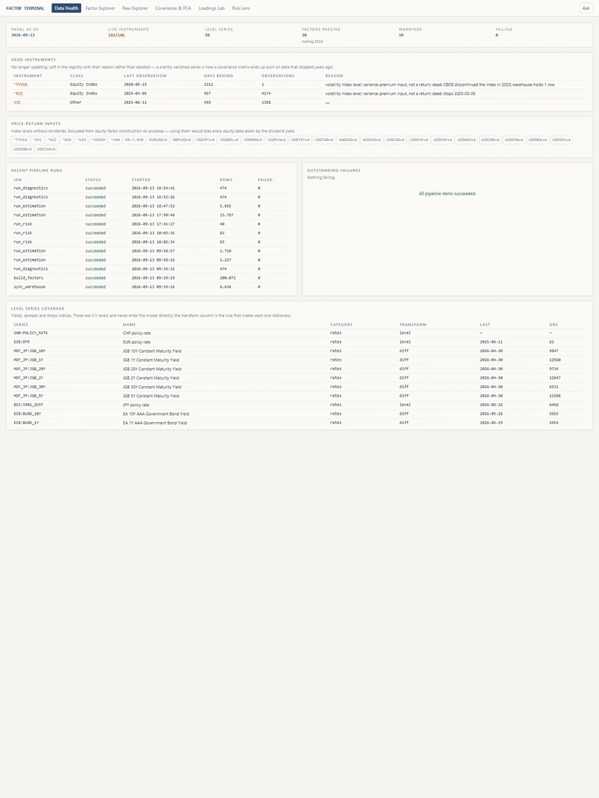

# Daily Multi-Asset Factor Model

A fully return-based factor model implementing the nine daily proxy blocks of §2.2
of a concept note on return-based multi-asset factor modelling (not included in
this repository), with an analyst frontend for
inspecting factors, the covariance structure, rolling loadings, and — the point of
the exercise — whether the model's predicted risk for a security is actually right.

No holdings, no look-through. Every model input is a stationary return series, and
that is tested rather than assumed.



*Data Health, Factor Explorer, Raw Explorer, Covariance & PCA, Loadings Lab, Risk
Lens. Regenerate with `python -m scripts.capture_screenshots` while the app is
running.*

**[Documentation/return-based-multi-asset-factor-model.md](Documentation/return-based-multi-asset-factor-model.md)**
is the model write-up: what the concept note asked for, what the data actually
supported, the decisions taken where the two differed, and the measured validation.
**[Documentation/factor-formulas.md](Documentation/factor-formulas.md)** gives every
one of the forty factors as a formula over named instruments, with the exact
equation that orthogonalises it.

---

## Starting the app

Double-click **`start.bat`**. It starts the API and the web app, waits until both
answer, and opens the browser. On a fresh checkout it also installs the web
dependencies and builds the frontend.

Run it again any time. Anything already serving is left alone rather than started
twice — with one exception it checks for: `next start` reads the build manifest
once, at boot, so rebuilding the frontend while it runs leaves it serving HTML that
points at the previous build's hashed chunks. Those files are gone, every asset
404s, and the page renders as unstyled HTML with no error anywhere. Port-probing
cannot see it, because the server answers 200 perfectly well. So the script follows
one stylesheet the page actually asks for, and restarts the web app when it does not
resolve.

To stop, close the two minimised *Factor Terminal* windows.

---

## First-time setup

```bash
python -m venv .venv && .venv/Scripts/pip install -r requirements.txt
cp .env.example .env
python -m backend.pipeline.apply_schema          # create the DB, apply migrations
python -m backend.pipeline.sync --full           # mirror the warehouse over FDW
python -m backend.pipeline.ingest_yahoo --full   # refresh the factor universe
python -m backend.pipeline.ingest_fred --full    # FRED levels
python -m backend.pipeline.build_factors         # construct the 40 factors
python -m backend.pipeline.run_diagnostics       # stationarity battery
```

Then estimate and score a security:

```bash
python -m backend.pipeline.sync --security US:AAPL
python -m backend.pipeline.run_estimation --instrument US:AAPL --window 252 --step 1m
python -m backend.pipeline.run_risk --instrument US:AAPL --horizon 21
```

`start.bat` handles the servers, but to run them by hand — with live reload on the
frontend, say:

```bash
.venv/Scripts/python -m uvicorn backend.app.main:app --port 8100
cd frontend && npm run dev                     # http://localhost:3100
```

The nightly refresh is one command:

```bash
python -m backend.pipeline.scheduler --once     # or omit --once to run as a daemon
```

---

## Layout

```
sql/            14 idempotent migrations, applied in order, fail-fast
backend/
  core/         pure numpy — no database access, so every statistic is testable
                stationarity · transforms · orthogonalize · regression
                covariance · risk · distribution
  pipeline/     ingestion, construction and estimation jobs
  app/          FastAPI: thin routers over raw SQL, plus the DeepSeek assistant
  tests/        279 tests, mostly against simulated data with known parameters
frontend/       Next.js 14 + Plotly, six pages
scripts/        one-off tooling: model probe, backfills, screenshot capture
```

The `backend/core` boundary is the main design decision. Every statistical routine
is a pure function over arrays, which is what makes the accuracy claims checkable:
the tests feed each one a process whose truth is known and assert it reaches the
right answer.

---

## Data

The model reads from the `xbrl_sec` warehouse over `postgres_fdw` and writes to its
own `factors` database. Where the warehouse was insufficient, this project fetches
directly:

| Gap found | Fix |
|---|---|
| Equity block had only price-return index levels | Added 12 total-return ETFs (ACWI, IVV, IWM, EFA, VGK, EWJ, EEM, …) |
| No daily gilt curve anywhere | `IGLT.L` as a total-return proxy |
| Liquidity block thin (TED and LIBOR-OIS discontinued) | Added SOFR, EFFR, OBFR, TGCRRATE, NFCI, ANFCI, STLFSI4 |
| Warehouse 3 months stale, ingestion manual | Own scheduled refresh; data is current |

Three series are dead and flagged rather than deleted: `^TYVIX` (discontinued 2020),
`^EVZ` (stops 2025-03), `JJC` (stops 2025-06). A liveness gate re-checks nightly.

---

## Methodology notes

Things that are easy to get wrong and are handled deliberately:

**Total return, not price return.** Yahoo `^`-prefixed index levels carry no
dividends; using them as equity factors biases every beta down by the dividend
yield. They are marked `is_total_return = false` and excluded from construction.

**Commodity futures.** Yahoo `=F` series are stitched front-month prices with a jump
at every roll — not a return series. The commodity block uses total-return ETFs,
which include roll and collateral, as §2.2 requires.

**Low-frequency macro is never forward-filled.** A weekly series filled into a daily
regressor manufactures information and understates standard errors (§3, Grundregel).
Such series become sparse release-event factors: the standardised change lands on
the publication day and the factor is exactly zero in between.

**Orthogonalisation is causal.** The block hierarchy of §4 is applied on a trailing
504-day window, refitted monthly. Full-sample residualisation would be exactly
orthogonal but would put future information into historical factor values — which
would flatter the model precisely where it is being judged. Measured residual
correlation: rolling −0.05, expanding −0.34, full-sample 0.00.

**The trading calendar excludes crypto.** Crypto prices seven days a week, which
added 1,229 weekend rows on which every other factor is missing. Left in, it made
252-row windows span fewer than 252 trading days and pushed equity factors below the
coverage threshold in the covariance matrix.

**Published factors validate, they never drive.** Fama-French and AQR lag by one to
two months and cannot feed a daily model. They are kept to confirm the in-house
constructions measure what their names claim: `eq_global` vs Mkt-RF r = 0.96,
`eq_size` vs SMB r = 0.93, `sty_momentum` vs Mom r = 0.62, and value/momentum
reproduce their well-known negative correlation.

**Ill-conditioned windows are excluded from scoring.** With 40 factors on a 252-day
window, a period where few factors yet exist leaves the design near-singular; betas
explode in offsetting pairs and so does β′Σβ. Such forecasts are stored and flagged,
not silently dropped or silently used. The condition-number limit applies to both
factor panels; the VIF limit only to the orthogonalised one, where a high VIF is
anomalous rather than — as on the raw panel — the definition of the factor set.

**Green and red are a claim, not decoration.** Colour on a diagnostic says whether
the number is what the model wants, and the rule lives in one file
(`frontend/src/lib/verdict.ts`) so the Factor Explorer and the Raw Explorer cannot
colour the same p-value differently. There are three tones, and the third carries
the weight: green where the test says what we want, amber where it flags something
nothing is gated on, and plain where the outcome is expected. A rejected ARCH-LM or
Jarque-Bera test is never red — volatility clustering and fat tails are the normal
condition of a daily return series, and a GARCH process is strictly stationary. Only
the joint ADF × KPSS verdict, a wrong VaR breach count, and a design past the
condition-number limit earn red.

**The model estimates on either factor panel.** Raw factors or block-hierarchy
residuals, chosen per spec and carried through to the covariance matrix, because
β′Σβ needs Σ to be the covariance of the same series the βs refer to. Both are
offered because the choice is a modelling decision rather than a fact, and the
comparison is measurable: on US:AAPL the raw panel fits better in sample (adj. R²
0.481 vs 0.442) and forecasts distinctly worse out of it (Mincer-Zarnowitz slope
0.35 vs 1.02). That is the case for the hierarchy, made out of sample.

---

## The assistant

The **Ask** panel answers questions about the methodology and about the numbers on
the page in front of you. It runs on DeepSeek and is grounded two ways: a
methodology corpus assembled at startup from the module docstrings in
`backend/core/` and the `note` field on every factor in `backend/pipeline/
factor_defs.py`, and a snapshot of exactly what the open page has rendered.

It has no tools and no database access of its own, which is deliberate. The system
prompt makes the supplied figures authoritative over the model's own arithmetic, so
asked for something that is not in view it names the page that produces it rather
than estimating. Three live tests hold it to that.

Set `DEEPSEEK_API_KEY` in the environment. `python -m scripts.probe_deepseek` checks
which model actually returns text with the full corpus in the prompt — worth running
before changing `DEEPSEEK_MODEL`, since the reasoning tiers can spend their whole
output budget on hidden reasoning and return nothing.

---

## Stationarity

A single ADF test is useless as a gate — on daily returns it rejects almost always.
The battery is built to catch what actually goes wrong:

| Test | Catches |
|---|---|
| ADF × KPSS, read jointly | A level that should have been differenced |
| Zivot-Andrews | A structural break masquerading as a unit root |
| Lo-MacKinlay variance ratio | Stale or smoothed pricing (§6.3) |
| Ljung-Box | Autocorrelation, the second stale-pricing signal |
| ARCH-LM | Volatility clustering — **recorded, never gated**: a GARCH process is strictly stationary |
| Zero-return share | Illiquidity; the cheapest and often most telling check |

The ADF × KPSS cross gives four verdicts rather than one: stationary, unit root,
break-or-heteroskedasticity, or inconclusive. Only the second blocks a series.

---

## Verification

```bash
python -m pytest -q                                    # 279 tests
python -m pytest backend/tests/test_factor_validation.py   # needs a populated DB
```

The unit tests do not merely check that functions return numbers. Each feeds a
process with known properties and asserts the right conclusion: a random walk must
fail, an AR(1) with φ=0.5 must pass, a GARCH series must flag ARCH effects without
failing, a smoothed series must show a variance ratio above 1, a halved volatility
forecast must produce a bias ratio of 2, and clustered VaR breaches must be caught
by Christoffersen even when Kupiec sees nothing wrong with the count.

Two bugs were found this way and would not have been found otherwise: `arch`'s
`VarianceRatio` consumes a price level and differences internally, so passing
returns gave VR ≈ 1/q and flagged every clean factor as mean-reverting; and the
ridge penalty was scaled by σ⁻² instead of σ², which shrank every loading to zero at
λ = 1.
